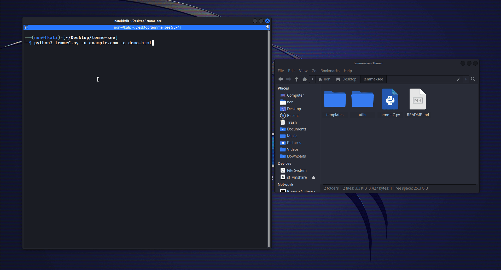

# Lemme-See quick recon using OSINT



# About Lemme-See

"Lemme-See" passively collects information for a domain name, utilizing OSINT.
The information gathered from each source, including IP addresses, open ports, subdomains, and more, 
is saved into text files and compiled into an HTML-formatted report.

### Features:
* Query Shodan's [internetdb API](https://internetdb.shodan.io/) for open ports, vulnerabilities, hostnames, and more (No API key required)
* Query [Urlscan](https://urlscan.io/) API for subdomains (No API key required)
* Check [crt.sh](https://crt.sh/) for subdomains
* Query [Threat Crowd](http://ci-www.threatcrowd.org/) API for subdomains (No API key required)
* Generate a single-page HTML report
* Use a custom template for the HTML report

### Installing prerequisites 
##### Debian based systems
```
sudo apt install python3-{bs4,jinja2,requests,dnspython}

```
##### Using pip3
```
pip3 install bs4 requests jinja2 dnspython 
```

### Available options
```
usage: python3 lemmeC.py -u <target domain> (options)

options:
  -h, --help            show this help message and exit
  -d DOMAIN, --domain DOMAIN
                        Target domain name to check (e.g. -d targetdomain.site)
  -o OUTPUT, --output OUTPUT
                        Name or path to save the results (e.g. -o results_for_domain)
  -t TEMPLATE, --template TEMPLATE
                        User specified HTML template (e.g. -t mytemplate.html)
  -w, --web             This option tells lemme-see to just return a Python dictionary with the results and does not generate a report
```

### Usage examples:
```
python3 lemmeC.py -d target.com
python3 lemmeC.py -d target.com -t /home/user/Desktop/template.thml
python3 lemmeC.py -d target.com -o target_results

```
